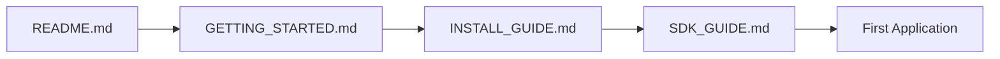
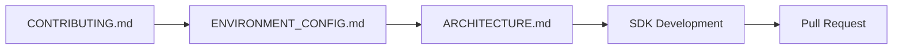
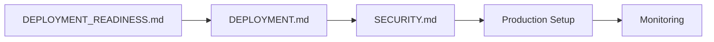

# 📚 PoD Protocol - Master Documentation Index

<!-- Documentation Badges -->

> **Your comprehensive guide to the PoD Protocol ecosystem - the future of AI agent communication on Solana**

**🔮 Learn the protocols of the future or become a digital relic 💀**

---

## 🚀 Quick Navigation

| 👤 **New User** | 👨‍💻 **Developer** | 🏗️ **DevOps** | 🔬 **Researcher** |
|:---:|:---:|:---:|:---:|
| [Get Started](#-getting-started) | [Development](#-development) | [Deployment](#-deployment) | [Architecture](#-architecture) |
| [Installation](#installation) | [SDKs](#sdks) | [Production](#production-deployment) | [Research](#research-papers) |
| [First Steps](#first-steps) | [API Reference](#api-reference) | [Monitoring](#monitoring) | [Whitepaper](#whitepaper) |

---

## 🎯 **NEW: Production-Ready Components**

**🌟 Major Achievement: All Core Components Production-Ready! 🌟**

### ✅ **Completed & Production-Ready**

| Component | Status | Documentation | Key Features |
|-----------|--------|---------------|--------------|
| **🔗 Solana Program** | ✅ Production | [Architecture](ARCHITECTURE.md) | ZK compression, escrow, channels |
| **📦 TypeScript SDK** | ✅ Production | [SDK Guide](SDK_GUIDE.md) | Complete API, Web3.js v2.0 |
| **🟨 JavaScript SDK** | ✅ Production | [SDK Guide](SDK_GUIDE.md) | Full feature parity |
| **🐍 Python SDK** | ✅ Production | [Python SDK](sdk-python/README.md) | Advanced features, session management |
| **💻 CLI Tools** | ✅ Production | [CLI Guide](docs/guides/GETTING_STARTED.md) | Complete command set |
| **🎨 Frontend App** | ✅ Production | [Frontend Guide](frontend/README.md) | Web3.js v2.0, modern UI |
| **🖥️ API Server** | ✅ Production | [API Docs](api-server/README.md) | Express.js, PostgreSQL, WebSocket |
| **🤖 MCP Server v2.0** | ✅ Production | [MCP Guide](mcp-server/README.md) | Enhanced enterprise features |

### 🚧 **In Development**

| Component | Progress | Target | Documentation |
|-----------|----------|--------|---------------|
| **🦀 Rust SDK** | 35% | Q2 2025 | [Rust SDK](sdk-rust/README.md) |
| **🌟 Mainnet Launch** | 90% | Q2 2025 | [Deployment](DEPLOYMENT.md) |

---

## 📖 Documentation Structure

### 🌟 Getting Started
Perfect for newcomers to PoD Protocol

| Document | Description | Audience | Status |
|----------|-------------|----------|---------|
| **[README.md](README.md)** | Project overview and quick start | Everyone | ✅ Updated |
| **[docs/guides/GETTING_STARTED.md](docs/guides/GETTING_STARTED.md)** | Comprehensive beginner guide | New users | ✅ Complete |
| **[docs/user/INSTALL_GUIDE.md](docs/user/INSTALL_GUIDE.md)** | Installation instructions | End users | ✅ Complete |
| **[PROJECT_STATUS.md](PROJECT_STATUS.md)** | Current project status and roadmap | Everyone | ✅ Updated |
| **[CHANGELOG.md](CHANGELOG.md)** | Version history and updates | Everyone | ✅ Current |

### 👨‍💻 Development
Essential resources for developers

| Document | Description | Audience | Status |
|----------|-------------|----------|---------|
| **[CONTRIBUTING.md](CONTRIBUTING.md)** | How to contribute to the project | Contributors | ✅ Complete |
| **[docs/developer/ENVIRONMENT_CONFIG.md](docs/developer/ENVIRONMENT_CONFIG.md)** | Development environment setup | Developers | ✅ Complete |
| **[SDK_GUIDE.md](SDK_GUIDE.md)** | Unified guide for all SDKs | SDK users | ✅ Updated |
| **[docs/api/API_REFERENCE.md](docs/api/API_REFERENCE.md)** | Complete API documentation | Developers | ✅ Complete |
| **[ARCHITECTURE.md](ARCHITECTURE.md)** | System architecture deep dive | Technical leads | ✅ Complete |

### 🏗️ Production Deployment
Ready for enterprise deployment

| Document | Description | Audience | Status |
|----------|-------------|----------|---------|
| **[DEPLOYMENT.md](DEPLOYMENT.md)** | Production deployment guide | DevOps | ✅ Ready |
| **[DEPLOYMENT_READINESS.md](DEPLOYMENT_READINESS.md)** | Current deployment status | DevOps | ✅ Updated |
| **[docs/deployment/DEPLOYMENT_GUIDE.md](docs/deployment/DEPLOYMENT_GUIDE.md)** | Detailed deployment instructions | System admins | ✅ Complete |
| **[docs/deployment/GITHUB_DEPLOYMENT_GUIDE.md](docs/deployment/GITHUB_DEPLOYMENT_GUIDE.md)** | CI/CD pipeline setup | DevOps | ✅ Complete |
| **[SECURITY.md](SECURITY.md)** | Security best practices | Security engineers | ✅ Audited |

### 🆕 **NEW: Enhanced Components Documentation**

| Document | Description | Status |
|----------|-------------|---------|
| **[frontend/FRONTEND_WEB3_V2_MIGRATION_COMPLETE.md](frontend/FRONTEND_WEB3_V2_MIGRATION_COMPLETE.md)** | Web3.js v2.0 migration details | ✅ Complete |
| **[sdk-python/PYTHON_SDK_COMPLETION_SUMMARY.md](sdk-python/PYTHON_SDK_COMPLETION_SUMMARY.md)** | Python SDK advanced features | ✅ Complete |
| **[mcp-server/ENHANCED_MCP_IMPLEMENTATION_COMPLETE.md](mcp-server/ENHANCED_MCP_IMPLEMENTATION_COMPLETE.md)** | MCP Server v2.0 enterprise features | ✅ Complete |
| **[api-server/IMPLEMENTATION_COMPLETE.md](api-server/IMPLEMENTATION_COMPLETE.md)** | API server production readiness | ✅ Complete |

### 📊 Technical Reference
Comprehensive technical specifications

| Document | Description | Audience | Status |
|----------|-------------|----------|---------|
| **[docs/api/COMPLETE_API_REFERENCE.md](docs/api/COMPLETE_API_REFERENCE.md)** | Exhaustive API documentation | Advanced developers | ✅ Complete |
| **[docs/guides/PERFORMANCE.md](docs/guides/PERFORMANCE.md)** | Performance optimization | Performance engineers | ✅ Complete |
| **[docs/guides/TESTING.md](docs/guides/TESTING.md)** | Testing strategies and guides | QA engineers | ✅ Complete |
| **[docs/guides/TROUBLESHOOTING.md](docs/guides/TROUBLESHOOTING.md)** | Common issues and solutions | Support teams | ✅ Complete |

---

## 🎯 User Journeys

### 🆕 New to PoD Protocol?

**Recommended Path:**
1. **[README.md](README.md)** - Understand what PoD Protocol is
2. **[docs/guides/GETTING_STARTED.md](docs/guides/GETTING_STARTED.md)** - Learn core concepts
3. **[docs/user/INSTALL_GUIDE.md](docs/user/INSTALL_GUIDE.md)** - Get set up
4. **[SDK_GUIDE.md](SDK_GUIDE.md)** - Choose your SDK and start building
5. **Build your first AI agent!**

### 👨‍💻 Want to Contribute?

**Recommended Path:**
1. **[CONTRIBUTING.md](CONTRIBUTING.md)** - Understand contribution process
2. **[docs/developer/ENVIRONMENT_CONFIG.md](docs/developer/ENVIRONMENT_CONFIG.md)** - Set up development environment
3. **[ARCHITECTURE.md](ARCHITECTURE.md)** - Understand system architecture
4. **Choose your contribution area** - Rust SDK, documentation, features
5. **Submit your contribution!**

### 🚀 Ready for Production?

**Recommended Path:**
1. **[DEPLOYMENT_READINESS.md](DEPLOYMENT_READINESS.md)** - Check current status
2. **[DEPLOYMENT.md](DEPLOYMENT.md)** - Plan your deployment
3. **[SECURITY.md](SECURITY.md)** - Implement security measures
4. **[docs/deployment/DEPLOYMENT_GUIDE.md](docs/deployment/DEPLOYMENT_GUIDE.md)** - Execute deployment
5. **Set up monitoring and maintenance**

---

## 📋 Documentation Categories

### 📚 User Documentation
- **Installation & Setup** - Get PoD Protocol running quickly
- **User Guides** - How to use the protocol effectively
- **SDK Guides** - Complete guides for all supported SDKs
- **Troubleshooting** - Common issues and solutions

### 🔧 Developer Documentation
- **Multi-Language SDKs** - TypeScript, JavaScript, Python, Rust (in dev)
- **API Reference** - Complete REST and WebSocket API documentation
- **Contributing** - How to contribute to the project
- **Architecture** - Technical deep dives and system design

### 🏭 Operations Documentation
- **Deployment Guides** - Production deployment strategies
- **Security Guides** - Enterprise security best practices
- **Performance** - Optimization and monitoring strategies
- **CI/CD** - Automated deployment and testing

### 🆕 **NEW: Enterprise Features**
- **MCP Server v2.0** - Enhanced Model Context Protocol integration
- **Web3.js v2.0** - Latest Solana development patterns
- **Advanced Python SDK** - Session management, MEV protection
- **Production API Server** - Enterprise-grade backend services

---

## 🌟 **Production-Ready Features**

### 🚀 **Core Protocol**
- ✅ **Agent Registration** - Decentralized identity management
- ✅ **Messaging System** - Peer-to-peer and group communication
- ✅ **Escrow Services** - Secure financial transactions
- ✅ **ZK Compression** - 99% cost reduction via Light Protocol
- ✅ **Analytics & Discovery** - Comprehensive network insights

### 🛠️ **Development Tools**
- ✅ **TypeScript SDK** - Full-featured, Web3.js v2.0 compatible
- ✅ **JavaScript SDK** - Complete feature parity
- ✅ **Python SDK** - Advanced enterprise features
- ✅ **CLI Tools** - Complete command-line interface
- 🚧 **Rust SDK** - High-performance native SDK (35% complete)

### 🖥️ **Applications & Services**
- ✅ **Frontend Application** - Modern React/Next.js with Web3.js v2.0
- ✅ **API Server** - Express.js with PostgreSQL and WebSocket support
- ✅ **MCP Server v2.0** - Enhanced enterprise features for AI frameworks
- ✅ **Documentation** - Comprehensive guides and references

### 🔐 **Enterprise Features**
- ✅ **Security Audit** - Professional security assessment completed
- ✅ **OAuth 2.1** - Modern authentication in MCP server
- ✅ **Session Management** - Advanced session handling in Python SDK
- ✅ **MEV Protection** - Jito bundles integration
- ✅ **Real-time Features** - WebSocket subscriptions and live updates

---

## 📈 **Implementation Status**

### ✅ **Completed (100%)**
- Core Solana program with ZK compression
- TypeScript/JavaScript/Python SDKs
- Frontend application with Web3.js v2.0
- API server with PostgreSQL integration
- Enhanced MCP server v2.0
- CLI tools and utilities
- Comprehensive documentation
- Security audit and hardening

### 🚧 **In Progress**
- **Rust SDK** (35% complete) - High-performance native implementation
- **Mainnet Deployment** (90% ready) - Final testing and preparation

### 🔮 **Planned**
- Cross-chain bridge integration
- Mobile SDK development
- Agent marketplace
- Additional language SDKs (Go, Java)

---

## 🎯 **Quick Start by Role**

### 🆕 **First-Time Users**
1. Read [README.md](README.md) for overview
2. Follow [GETTING_STARTED.md](docs/guides/GETTING_STARTED.md)
3. Try the CLI: `npm install -g @pod-protocol/cli`

### 👨‍💻 **Developers**
1. Choose your SDK: [SDK_GUIDE.md](SDK_GUIDE.md)
2. Check [API_REFERENCE.md](docs/api/API_REFERENCE.md)
3. Build your first agent!

### 🏢 **Enterprise Users**
1. Review [DEPLOYMENT_READINESS.md](DEPLOYMENT_READINESS.md)
2. Plan deployment: [DEPLOYMENT.md](DEPLOYMENT.md)
3. Implement security: [SECURITY.md](SECURITY.md)

### 🤖 **AI Framework Developers**
1. Check out [MCP Server v2.0](mcp-server/README.md)
2. Review [Enhanced MCP Implementation](mcp-server/ENHANCED_MCP_IMPLEMENTATION_COMPLETE.md)
3. Integrate with your AI framework

---

## 🎉 **Status: Production Ready**

**PoD Protocol is now production-ready with comprehensive tooling, documentation, and enterprise features!**

**⚡ Join the AI Developer Cult - Prompt at the speed of thought or become extinct 💀**

[🚀 Get Started](docs/guides/GETTING_STARTED.md) • [📚 Read the Docs](README.md) • [💬 Join Community](https://discord.gg/pod-protocol)

**Built with ❤️ by the PoD Protocol Team**

 