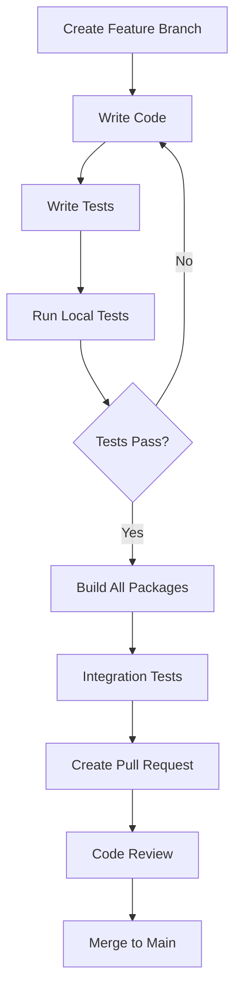

# 🚀 Complete Developer Onboarding Guide

<div align="center">


**Welcome to PoD Protocol Development!**

*This comprehensive guide will get you from zero to productive developer in 30 minutes*

</div>

---

## 📋 Table of Contents

1. [🎯 Quick Overview](#-quick-overview)
2. [⚡ Express Setup (5 minutes)](#-express-setup-5-minutes)
3. [🛠️ Complete Setup (15 minutes)](#️-complete-setup-15-minutes)
4. [📦 Package Overview](#-package-overview)
5. [🔧 Development Workflow](#-development-workflow)
6. [🧪 Testing Guide](#-testing-guide)
7. [🚀 Deployment](#-deployment)
8. [❓ Troubleshooting](#-troubleshooting)
9. [🤝 Getting Help](#-getting-help)

---

## 🎯 Quick Overview

PoD Protocol is an AI Agent Communication Protocol built on Solana. As a developer, you'll work with:

<table>
<tr>
<th>Component</th>
<th>Technology</th>
<th>Your Role</th>
</tr>
<tr>
<td>🦀 <strong>Solana Programs</strong></td>
<td>Rust + Anchor</td>
<td>Smart contract development</td>
</tr>
<tr>
<td>📦 <strong>SDKs</strong></td>
<td>TypeScript/JavaScript/Python</td>
<td>Client library development</td>
</tr>
<tr>
<td>💻 <strong>CLI</strong></td>
<td>Node.js + TypeScript</td>
<td>Developer tooling</td>
</tr>
<tr>
<td>🎨 <strong>Frontend</strong></td>
<td>Next.js + React</td>
<td>User interface development</td>
</tr>
</table>

---

## ⚡ Express Setup (5 minutes)

### Step 1: Prerequisites Check

```bash
# Check Node.js (need 18+)
node --version

# Check if you have git
git --version

# Check if you have a code editor
code --version  # VS Code
```

### Step 2: Clone & Install

```bash
# Clone the repository
git clone https://github.com/PoD-Protocol/pod-protocol.git
cd pod-protocol

# Run express setup
npm run setup:express

# Verify installation
npm run verify:setup
```

### Step 3: First Run

```bash
# Start development environment
npm run dev

# In another terminal, run tests
npm test

# Check CLI works
npx pod-cli --help
```

**🎉 You're ready to develop! Skip to [Development Workflow](#-development-workflow)**

---

## 🛠️ Complete Setup (15 minutes)

### Step 1: System Requirements

<details>
<summary><strong>📱 Operating System Support</strong></summary>

| OS | Status | Notes |
|---|---|---|
| 🐧 **Linux** | ✅ Fully Supported | Recommended for development |
| 🍎 **macOS** | ✅ Fully Supported | Great for development |
| 🪟 **Windows** | ✅ Supported | Use WSL2 for best experience |

</details>

<details>
<summary><strong>🔧 Required Tools</strong></summary>

```bash
# Node.js 18+ (use nvm for version management)
curl -o- https://raw.githubusercontent.com/nvm-sh/nvm/v0.39.0/install.sh | bash
nvm install 18
nvm use 18

# Rust (for Solana program development)
curl --proto '=https' --tlsv1.2 -sSf https://sh.rustup.rs | sh
source ~/.cargo/env

# Solana CLI
sh -c "$(curl -sSfL https://release.solana.com/v1.18.0/install)"

# Anchor Framework
npm install -g @coral-xyz/anchor-cli
```

</details>

### Step 2: Repository Setup

```bash
# Clone with full history
git clone --recursive https://github.com/PoD-Protocol/pod-protocol.git
cd pod-protocol

# Install dependencies
npm install

# Set up git hooks
npm run setup:git-hooks

# Configure environment
cp .env.example .env.local
```

### Step 3: Package Manager Setup

```bash
# We use multiple package managers for different components
npm run setup:package-managers

# This installs:
# - npm (Node.js packages)
# - cargo (Rust packages)
# - anchor (Solana programs)
# - pip (Python SDK)
```

### Step 4: Development Environment

```bash
# Build all packages
npm run build:all

# Start local Solana validator
npm run solana:start

# Deploy programs to local
npm run programs:deploy:local

# Start development servers
npm run dev:all
```

### Step 5: Verification

```bash
# Run comprehensive verification
npm run verify:complete

# This checks:
# ✅ All dependencies installed
# ✅ Programs compile and deploy
# ✅ SDKs build successfully
# ✅ Tests pass
# ✅ CLI commands work
```

---

## 📦 Package Overview

### 🦀 Programs (`programs/`)

**Smart contracts written in Rust using Anchor framework**

```bash
cd programs/pod-com

# Build program
anchor build

# Test program
anchor test

# Deploy to devnet
anchor deploy --provider.cluster devnet
```

**Key Files:**
- `lib.rs` - Main program logic
- `instructions/` - Individual instruction handlers
- `state/` - Account state definitions
- `errors.rs` - Custom error definitions

### 📦 TypeScript SDK (`sdk/`)

**Main SDK for TypeScript/JavaScript developers**

```bash
cd sdk

# Install dependencies
npm install

# Build SDK
npm run build

# Run tests
npm test

# Generate documentation
npm run docs
```

**Key Files:**
- `src/client.ts` - Main client class
- `src/instructions/` - Instruction builders
- `src/accounts/` - Account parsers
- `src/types/` - Type definitions

### 🟨 JavaScript SDK (`sdk-js/`)

**Optimized SDK for pure JavaScript environments**

```bash
cd sdk-js

# Install and build
npm install && npm run build

# Run browser tests
npm run test:browser

# Run Node.js tests
npm run test:node
```

### 🐍 Python SDK (`sdk-python/`)

**Python SDK for ML/AI integration**

```bash
cd sdk-python

# Set up virtual environment
python -m venv venv
source venv/bin/activate  # Linux/Mac
# or
venv\\Scripts\\activate  # Windows

# Install in development mode
pip install -e .

# Run tests
pytest
```

### 💻 CLI (`cli/`)

**Command-line interface for developers**

```bash
cd cli

# Install globally for development
npm link

# Test CLI commands
pod-cli --help
pod-cli config init
pod-cli agent register --help
```

### 🎨 Frontend (`frontend/`)

**Next.js web application**

```bash
cd frontend

# Install dependencies
npm install

# Start development server
npm run dev

# Build for production
npm run build

# Run tests
npm run test
```

---

## 🔧 Development Workflow

### 🎯 Typical Development Process



### 🌟 Feature Development

**1. Create Feature Branch**
```bash
# Always branch from main
git checkout main
git pull origin main
git checkout -b feature/your-feature-name
```

**2. Development Commands**
```bash
# Start development environment
npm run dev

# Watch mode for specific package
npm run dev:sdk
npm run dev:cli
npm run dev:frontend

# Run tests in watch mode
npm run test:watch
```

**3. Testing Your Changes**
```bash
# Unit tests
npm run test:unit

# Integration tests
npm run test:integration

# E2E tests
npm run test:e2e

# Specific package tests
npm run test:programs
npm run test:sdk
npm run test:cli
```

**4. Code Quality**
```bash
# Lint all code
npm run lint:all

# Format all code
npm run format:all

# Type checking
npm run type-check
```

### 🔄 Common Tasks

<details>
<summary><strong>🔧 Adding New SDK Method</strong></summary>

**Step 1: Add to TypeScript SDK**
```typescript
// sdk/src/instructions/newFeature.ts
export class NewFeatureInstruction {
  static async build(params: NewFeatureParams): Promise<TransactionInstruction> {
    // Implementation
  }
}
```

**Step 2: Add to Client**
```typescript
// sdk/src/client.ts
public async newFeature(params: NewFeatureParams) {
  const instruction = await NewFeatureInstruction.build(params);
  return this.sendTransaction([instruction]);
}
```

**Step 3: Add Tests**
```typescript
// sdk/tests/newFeature.test.ts
describe('NewFeature', () => {
  it('should execute new feature', async () => {
    // Test implementation
  });
});
```

**Step 4: Update Documentation**
```bash
npm run docs:generate
```

</details>

<details>
<summary><strong>🦀 Modifying Solana Program</strong></summary>

**Step 1: Update Program Code**
```rust
// programs/pod-com/src/instructions/new_instruction.rs
pub fn new_instruction(ctx: Context<NewInstruction>) -> Result<()> {
    // Implementation
}
```

**Step 2: Add to Program**
```rust
// programs/pod-com/src/lib.rs
pub mod new_instruction;

#[program]
pub mod pod_com {
    pub fn new_instruction(ctx: Context<NewInstruction>) -> Result<()> {
        instructions::new_instruction::handler(ctx)
    }
}
```

**Step 3: Generate IDL**
```bash
cd programs/pod-com
anchor build
```

**Step 4: Update SDKs**
```bash
# Generate TypeScript types from IDL
npm run generate:types

# Update SDK client
npm run sdk:update
```

</details>

---

## 🧪 Testing Guide

### 🎯 Testing Strategy

We use a comprehensive testing approach:

| Test Type | When to Run | Command |
|-----------|-------------|---------|
| **Unit Tests** | After every change | `npm run test:unit` |
| **Integration Tests** | Before commits | `npm run test:integration` |
| **E2E Tests** | Before releases | `npm run test:e2e` |
| **Performance Tests** | Weekly | `npm run test:performance` |

### 🔬 Test Environment Setup

```bash
# Start test environment
npm run test:env:start

# This starts:
# - Local Solana validator
# - Test databases
# - Mock services
```

### 📊 Running Tests

**All Tests**
```bash
# Run complete test suite
npm test

# With coverage
npm run test:coverage
```

**Specific Test Types**
```bash
# Programs tests (Rust)
npm run test:programs

# SDK tests
npm run test:sdk

# CLI tests
npm run test:cli

# Frontend tests
npm run test:frontend
```

**Interactive Testing**
```bash
# Watch mode
npm run test:watch

# Debug mode
npm run test:debug

# Specific test file
npm test -- newFeature.test.ts
```

### 🐛 Debugging Tests

```bash
# Debug with VS Code
npm run test:debug:vscode

# Debug with Chrome DevTools
npm run test:debug:chrome

# Verbose output
npm run test:verbose
```

---

## 🚀 Deployment

### 🌍 Deployment Environments

| Environment | Purpose | Branch | URL |
|-------------|---------|--------|-----|
| **Local** | Development | any | `localhost` |
| **Devnet** | Testing | `develop` | `devnet.podprotocol.io` |
| **Testnet** | Staging | `staging` | `testnet.podprotocol.io` |
| **Mainnet** | Production | `main` | `podprotocol.io` |

### 📦 Build & Deploy

**Build for Production**
```bash
# Build all packages
npm run build:production

# Build specific packages
npm run build:programs
npm run build:sdk
npm run build:cli
npm run build:frontend
```

**Deploy Programs**
```bash
# Deploy to devnet
npm run deploy:devnet

# Deploy to testnet
npm run deploy:testnet

# Deploy to mainnet (requires authorization)
npm run deploy:mainnet
```

**Publish Packages**
```bash
# Publish SDK to npm
npm run publish:sdk

# Publish CLI to npm
npm run publish:cli

# Publish Python SDK to PyPI
npm run publish:python
```

---

## ❓ Troubleshooting

### 🔧 Common Issues

<details>
<summary><strong>📦 Installation Issues</strong></summary>

**Issue: `npm install` fails**
```bash
# Clear npm cache
npm cache clean --force

# Delete node_modules and reinstall
rm -rf node_modules package-lock.json
npm install

# Use specific Node version
nvm use 18
npm install
```

**Issue: Rust compilation fails**
```bash
# Update Rust
rustup update

# Install required targets
rustup target add bpf-unknown-unknown

# Clear Rust cache
cargo clean
```

**Issue: Anchor build fails**
```bash
# Update Anchor
anchor --version
avm install latest
avm use latest

# Clear Anchor cache
rm -rf target/
anchor build
```

</details>

<details>
<summary><strong>🧪 Test Failures</strong></summary>

**Issue: Tests timeout**
```bash
# Increase timeout
npm test -- --timeout=30000

# Run tests individually
npm test -- --testNamePattern="specific test"
```

**Issue: Solana validator issues**
```bash
# Kill existing validator
pkill solana-test-validator

# Start fresh validator
npm run solana:start:fresh

# Check validator logs
solana logs
```

</details>

<details>
<summary><strong>🔧 Development Issues</strong></summary>

**Issue: Hot reload not working**
```bash
# Restart development server
npm run dev:restart

# Clear Next.js cache
rm -rf .next
npm run dev
```

**Issue: TypeScript errors**
```bash
# Generate fresh types
npm run generate:types

# Check TypeScript config
npx tsc --noEmit
```

</details>

### 📞 Getting Help

**Check These First:**
1. [Common Issues Wiki](https://github.com/PoD-Protocol/pod-protocol/wiki/Common-Issues)
2. [FAQ](../user/FAQ.md)
3. [API Documentation](../api/API_REFERENCE.md)

**Community Support:**
- 💬 [Discord Developer Channel](https://discord.gg/pod-protocol-dev)
- 🐛 [GitHub Issues](https://github.com/PoD-Protocol/pod-protocol/issues)
- 💭 [GitHub Discussions](https://github.com/PoD-Protocol/pod-protocol/discussions)

**Direct Support:**
- 📧 Email: `dev-support@podprotocol.io`
- 🎯 Priority Support: Available for core contributors

---

## 🤝 Getting Help

### 🎯 Quick Help

**Immediate Help:**
```bash
# Built-in help system
npm run help

# CLI help
pod-cli --help
pod-cli [command] --help

# Check system status
npm run status
```

**Documentation:**
- 📖 [Complete Documentation](../README.md)
- 🔗 [API Reference](../api/API_REFERENCE.md)
- 🏗️ [Architecture Guide](../guides/ARCHITECTURE.md)
- 🔒 [Security Guide](../guides/SECURITY.md)

### 🌟 Advanced Development

**Performance Optimization:**
- [Performance Guide](./PERFORMANCE.md)
- [Optimization Tips](./OPTIMIZATION.md)

**Security Best Practices:**
- [Security Checklist](./SECURITY_CHECKLIST.md)
- [Code Review Guidelines](./CODE_REVIEW.md)

**Contributing:**
- [Contributing Guide](./CONTRIBUTING.md)
- [Code Style Guide](./CODE_STYLE.md)
- [Commit Guidelines](./COMMIT_GUIDELINES.md)

---

<div align="center">

**🎉 Welcome to the PoD Protocol Development Team! 🎉**

*You're now ready to build the future of AI communication*

[🚀 Start Coding](https://github.com/PoD-Protocol/pod-protocol) • [💬 Join Discord](https://discord.gg/pod-protocol) • [📚 Read Docs](../README.md)

</div>
