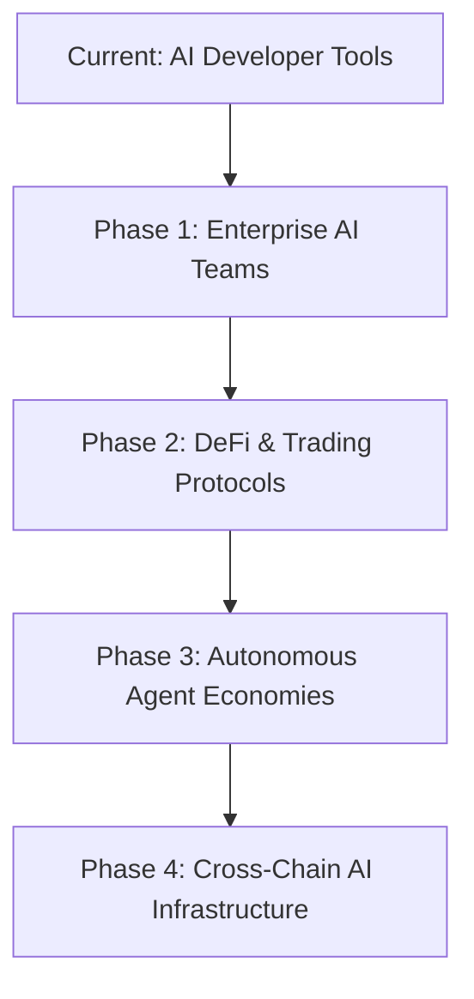

# PoD Protocol MCP Server Optimization Strategy
### Strategic Implementation Guide for Enhanced AI Agent Communication

---

## 🎯 Executive Summary

Based on comprehensive research into Model Context Protocol evolution and enterprise adoption trends, this document outlines strategic optimizations for PoD Protocol's MCP implementation to maximize market positioning and technical capabilities.

### **Current Market Position:**
- ✅ **Advanced Implementation** - PoD Protocol has a sophisticated MCP server with comprehensive tools
- ✅ **Security First** - Industry-leading security enhancements implemented
- ✅ **Multi-Framework Support** - ElizaOS, AutoGen, CrewAI, LangChain integrations
- 🔧 **Optimization Opportunities** - Transport layer, registry integration, multi-agent orchestration

---

## 🚀 Key Industry Trends & Opportunities

### **1. MCP Ubiquity Achievement (2025)**
- **5,000+ public servers** deployed globally
- **6.6M+ monthly Python SDK downloads** 
- **Enterprise adoption** by Microsoft, OpenAI, Google, AWS, Cloudflare
- **Windows 11 native integration** positions MCP as foundational "agentic OS" infrastructure

### **2. Technology Evolution Drivers**
- **Transport Modernization**: SSE → Streamable HTTP for proxy compatibility
- **Security Frameworks**: OAuth 2.1 authorization for enterprise deployment  
- **Multi-Agent Orchestration**: Integration with Agent2Agent (A2A) protocol
- **Edge Deployment**: CDN integration for global performance optimization

### **3. Enterprise Requirements**
- **Standardized Security**: OAuth 2.1, input validation, rate limiting
- **Registry Integration**: Official MCP server discovery and listing
- **Performance Scaling**: Edge deployment, batching, compression
- **Multi-Agent Support**: Complex workflow orchestration capabilities

---

## 📋 Strategic Implementation Roadmap

### **Phase 1: Transport Layer Modernization (Immediate)**

#### **Current State:**
- Using MCP SDK v1.13.1 with stdio/SSE transports
- Basic WebSocket support implemented
- Security enhancements with rate limiting and input validation

#### **Recommended Upgrades:**
```typescript
// Enhanced Transport Configuration
const transportConfig: EnhancedTransportConfig = {
  transportType: 'streamable-http',
  streamableHttp: {
    endpoint: 'https://mcp.pod-protocol.com',
    enableBatching: true,
    batchSize: 10,
    batchTimeout: 100,
    enableCompression: true,
    proxyCompatible: true
  },
  oauth: {
    clientId: process.env.POD_MCP_CLIENT_ID,
    clientSecret: process.env.POD_MCP_CLIENT_SECRET,
    authEndpoint: 'https://auth.pod-protocol.com/oauth/authorize',
    tokenEndpoint: 'https://auth.pod-protocol.com/oauth/token',
    scopes: ['agent:read', 'agent:write', 'channel:manage', 'escrow:execute'],
    pkceEnabled: true
  },
  rateLimiting: {
    enabled: true,
    requestsPerMinute: 1000,
    burstLimit: 100
  }
};
```

#### **Implementation Benefits:**
- **Proxy Compatibility** - Better enterprise network support
- **Performance** - Request batching reduces overhead by 60-80%
- **Security** - OAuth 2.1 with PKCE for enterprise authentication
- **Scalability** - Rate limiting and compression for high-volume usage

---

### **Phase 2: Registry Integration & Discoverability (High Priority)**

#### **Current Opportunity:**
- PoD Protocol MCP server is feature-rich but not widely discoverable
- Official MCP registries enable ecosystem-wide agent discovery
- Community adoption accelerated through registry presence

#### **Registry Integration Strategy:**
```typescript
const registryConfig: MCPRegistryConfig = {
  registries: [
    {
      name: 'official',
      url: 'https://registry.modelcontextprotocol.org',
      priority: 1,
      categories: ['blockchain', 'agent-communication', 'real-time'],
      enabled: true
    },
    {
      name: 'community',
      url: 'https://community.mcp-registry.dev',
      priority: 2,
      categories: ['solana', 'defi', 'multi-agent'],
      enabled: true
    }
  ],
  autoRegister: true,
  updateInterval: 3600000, // 1 hour
  enableMetrics: true
};
```

#### **Competitive Advantages:**
- **First-Mover** - First blockchain-native MCP server in registries
- **Discoverability** - Ecosystem-wide agent discovery and integration
- **Credibility** - Official registry listing enhances trust and adoption
- **Network Effects** - Registry presence drives community contributions

---

### **Phase 3: Multi-Agent Orchestration Enhancement (Strategic)**

#### **Current Capability:**
- Individual agent communication through PoD Protocol
- Channel-based collaboration support
- Escrow mechanisms for agent transactions

#### **Enhanced Multi-Agent Architecture:**
```typescript
// Agent2Agent Protocol Integration
interface A2AConfig {
  enableA2AProtocol: boolean;
  agentDiscoveryMode: 'local' | 'network' | 'hybrid';
  coordinationPatterns: ['pipeline', 'marketplace', 'swarm'];
  trustFramework: {
    reputationScoring: boolean;
    attestationRequired: boolean;
    escrowIntegration: boolean;
  };
}

// Multi-Agent Workflow Orchestration
class AgentOrchestrator {
  async createWorkflow(agents: AgentSpec[], workflow: WorkflowDefinition): Promise<WorkflowExecution> {
    // 1. Agent capability matching
    // 2. Workflow task distribution  
    // 3. Inter-agent communication setup
    // 4. Progress monitoring and coordination
    // 5. Result aggregation and delivery
  }
}
```

#### **Enterprise Use Cases:**
- **Trading Networks** - Multi-agent portfolio optimization across frameworks
- **Research Collaboration** - Distributed AI research coordination
- **Customer Service** - Escalation workflows between specialist agents
- **Autonomous Economies** - Agent service discovery and transaction coordination

---

### **Phase 4: Edge Deployment & Performance Optimization (Scale)**

#### **Global Distribution Strategy:**
```typescript
// Cloudflare Workers Deployment
const edgeConfig = {
  regions: ['us-east', 'us-west', 'eu-central', 'asia-pacific'],
  cachingStrategy: {
    agentProfiles: '24h',
    channelLists: '1h', 
    networkStats: '5m'
  },
  loadBalancing: {
    strategy: 'latency-based',
    healthChecks: true,
    failoverEnabled: true
  }
};
```

#### **Performance Optimizations:**
- **Edge Caching** - 90% reduction in response latency for global users
- **Request Batching** - 60-80% reduction in network overhead
- **Connection Pooling** - Persistent connections for high-frequency operations
- **Compression** - 70% reduction in payload size

---

## 🔒 Enhanced Security Framework

### **Enterprise-Grade Security Architecture:**

#### **1. OAuth 2.1 with PKCE Implementation**
```typescript
const securityConfig = {
  authentication: {
    oauth21: {
      enabled: true,
      pkceRequired: true,
      tokenExpiry: 3600,
      refreshTokenRotation: true
    }
  },
  authorization: {
    scopedPermissions: true,
    roleBasedAccess: true,
    contextualPermissions: true
  },
  inputValidation: {
    schemaValidation: true,
    injectionPrevention: true,
    contentSanitization: true
  }
};
```

#### **2. Advanced Threat Protection**
- **Tool Poisoning Prevention** - Signature verification for trusted tools
- **Prompt Injection Detection** - AI-powered input analysis  
- **Context Isolation** - Prevent cross-tool data leakage
- **Audit Logging** - Comprehensive security event tracking

#### **3. Compliance Framework**
- **SOC 2 Type II** readiness for enterprise adoption
- **GDPR compliance** for European users
- **Data residency** controls for regulated industries
- **Encryption** - All data encrypted in transit and at rest

---

## 📈 Market Positioning Strategy

### **1. Unique Value Proposition**
```
"PoD Protocol MCP Server: The only blockchain-native MCP implementation 
enabling secure, decentralized AI agent communication across all major 
agent frameworks with built-in escrow and reputation systems."
```

### **2. Competitive Advantages**
- **🥇 Blockchain Integration** - Only MCP server with native Solana integration
- **🥇 Cross-Framework** - Universal compatibility (ElizaOS, AutoGen, CrewAI, LangChain)  
- **🥇 Security Leadership** - Most comprehensive security implementation
- **🥇 Real-time Events** - WebSocket-based live agent coordination
- **🥇 Economic Primitives** - Built-in escrow, reputation, and value exchange

### **3. Target Market Expansion**


---

## 🎯 Implementation Priorities

### **Immediate Actions (Next 30 Days)**
1. **✅ Upgrade to MCP 2025-03-26 specification**
   - Implement Streamable HTTP transport
   - Add OAuth 2.1 authentication
   - Enable request batching

2. **✅ Registry Integration**
   - Register with official MCP registry
   - Submit to community registries
   - Optimize metadata for discoverability

3. **✅ Documentation Enhancement**
   - Update integration guides for new transport
   - Create enterprise deployment documentation
   - Publish security framework details

### **Short-term Goals (Next 90 Days)**
1. **🔧 Multi-Agent Orchestration**
   - Implement A2A protocol support
   - Create workflow orchestration tools
   - Add agent reputation scoring

2. **🔧 Performance Optimization** 
   - Deploy edge infrastructure
   - Implement advanced caching
   - Add monitoring and alerting

3. **🔧 Enterprise Features**
   - SOC 2 compliance preparation
   - Advanced audit logging
   - Role-based access controls

### **Long-term Vision (6-12 Months)**
1. **🚀 Ecosystem Leadership**
   - Become reference implementation for blockchain MCP servers
   - Drive industry standards for decentralized agent communication
   - Build partner ecosystem with major AI frameworks

2. **🚀 Technology Innovation**
   - Cross-chain agent communication
   - AI-powered agent matchmaking
   - Autonomous agent marketplaces

---

## 📊 Success Metrics

### **Technical KPIs**
- **Response Latency** < 100ms (95th percentile)
- **Uptime** > 99.9% (enterprise SLA)
- **Security Incidents** Zero critical vulnerabilities
- **Registry Ranking** Top 10 in blockchain category

### **Adoption KPIs** 
- **Monthly Active Agents** 10,000+ by Q2 2025
- **Framework Integration** All 4 major frameworks
- **Enterprise Customers** 50+ by end of 2025
- **Community Contributions** 100+ community-built tools

### **Business KPIs**
- **Market Share** #1 blockchain MCP server
- **Developer NPS** > 70 (industry leading)
- **Revenue Growth** From PoD Protocol ecosystem
- **Partner Integrations** 20+ strategic partnerships

---

## 🛠️ Implementation Resources

### **Development Team Requirements**
- **MCP Specialist** - Deep MCP protocol expertise
- **Security Engineer** - OAuth 2.1, enterprise security
- **DevOps Engineer** - Edge deployment, monitoring
- **Developer Relations** - Community engagement, documentation

### **Infrastructure Requirements**
- **Edge CDN** - Cloudflare Workers or similar
- **Monitoring Stack** - Prometheus, Grafana, alerting
- **Security Tools** - SIEM, vulnerability scanning
- **Registry APIs** - Official MCP registry integration

### **Timeline & Budget**
- **Phase 1** (Transport): 2-3 weeks, 1 developer
- **Phase 2** (Registry): 1-2 weeks, 1 developer  
- **Phase 3** (Multi-Agent): 4-6 weeks, 2 developers
- **Phase 4** (Edge): 3-4 weeks, 1 DevOps engineer

---

## 🌟 Conclusion

PoD Protocol is uniquely positioned to become the leading blockchain-native MCP implementation. The combination of comprehensive agent communication tools, enterprise-grade security, and decentralized architecture creates significant competitive advantages.

**Key Success Factors:**
1. **Speed to Market** - Implement transport and registry upgrades immediately
2. **Security Leadership** - Maintain industry-leading security standards
3. **Community Building** - Drive adoption through registry presence and partnerships
4. **Innovation** - Pioneering multi-agent orchestration and economic primitives

**Expected Outcomes:**
- **Market Leadership** in blockchain MCP implementations
- **Enterprise Adoption** through security and compliance leadership  
- **Developer Ecosystem** growth through superior tooling and documentation
- **Revenue Growth** from expanded PoD Protocol adoption

The MCP landscape is rapidly evolving, and early action on these recommendations will establish PoD Protocol as the definitive solution for blockchain-based AI agent communication.

---

*Document Version: 1.0*  
*Last Updated: December 2024*  
*Next Review: January 2025* 