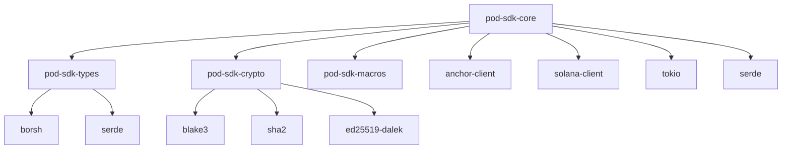

# PoD Protocol Rust SDK Architecture

This document provides an in-depth technical analysis of the Rust SDK architecture, design patterns, and implementation details.

## Table of Contents

1. [Overview](#overview)
2. [Core Architecture](#core-architecture)
3. [Service-Based Design](#service-based-design)
4. [Memory Management](#memory-management)
5. [Async Programming Model](#async-programming-model)
6. [Error Handling](#error-handling)
7. [Type System](#type-system)
8. [Security Architecture](#security-architecture)
9. [Performance Optimizations](#performance-optimizations)
10. [Cross-Platform Considerations](#cross-platform-considerations)

## Overview

The PoD Protocol Rust SDK is designed as a high-performance, memory-safe client library for interacting with the PoD Protocol Solana program. It follows modern Rust patterns and leverages the ecosystem's strengths while maintaining API compatibility with other SDK implementations.

### Design Principles

1. **Zero-Cost Abstractions**: High-level APIs with no runtime overhead
2. **Memory Safety**: Compile-time guarantees preventing memory-related bugs
3. **Async-First**: Built for high-concurrency applications
4. **Service Composition**: Modular design enabling selective feature usage
5. **Type Safety**: Leveraging Rust's type system for correctness
6. **Performance**: Optimized for minimal latency and high throughput

## Core Architecture

### Workspace Structure

```
sdk-rust/
├── Cargo.toml                    # Workspace configuration
├── crates/
│   ├── pod-sdk-core/             # Core SDK implementation
│   │   ├── src/
│   │   │   ├── lib.rs            # Public API exports
│   │   │   ├── client.rs         # Main PodComClient
│   │   │   ├── config.rs         # Configuration types
│   │   │   ├── error.rs          # Error types and handling
│   │   │   ├── types.rs          # Core protocol types
│   │   │   ├── utils/            # Utility modules
│   │   │   │   ├── mod.rs
│   │   │   │   ├── pda.rs        # Program Derived Address helpers
│   │   │   │   ├── retry.rs      # Retry logic
│   │   │   │   ├── validation.rs # Input validation
│   │   │   │   └── security.rs   # Security utilities
│   │   │   └── services/         # Service implementations
│   │   │       ├── mod.rs
│   │   │       ├── base.rs       # BaseService trait
│   │   │       ├── agent.rs      # Agent management
│   │   │       ├── message.rs    # Messaging
│   │   │       ├── channel.rs    # Channels
│   │   │       ├── escrow.rs     # Escrow operations
│   │   │       ├── analytics.rs  # Analytics
│   │   │       ├── discovery.rs  # Discovery
│   │   │       ├── ipfs.rs       # IPFS integration
│   │   │       └── zk_compression.rs # ZK compression
│   │   └── Cargo.toml
│   ├── pod-sdk-crypto/           # Cryptographic utilities
│   ├── pod-sdk-types/            # Shared type definitions
│   └── pod-sdk-macros/           # Procedural macros
├── examples/                     # Usage examples
├── benches/                      # Performance benchmarks
└── tests/                        # Integration tests
```

### Dependency Graph



## Service-Based Design

### BaseService Trait

The `BaseService` trait provides a common interface for all services, ensuring consistent error handling, configuration management, and lifecycle operations.

```rust
#[async_trait::async_trait]
pub trait BaseService: Send + Sync {
    type Error: std::error::Error + Send + Sync + 'static;
    
    /// Initialize the service with a program instance
    async fn initialize(&mut self, program: Program) -> Result<(), Self::Error>;
    
    /// Get the current program instance
    fn program(&self) -> Result<&Program, Self::Error>;
    
    /// Validate service configuration
    fn validate_config(&self) -> Result<(), Self::Error>;
    
    /// Get service metrics
    fn metrics(&self) -> ServiceMetrics;
}

/// Shared configuration for all services
#[derive(Debug, Clone)]
pub struct ServiceConfig {
    pub rpc_client: Arc<RpcClient>,
    pub program_id: Pubkey,
    pub commitment: CommitmentConfig,
    pub retry_config: RetryConfig,
    pub timeout: Duration,
}
```

### Service Implementation Pattern

Each service follows a consistent implementation pattern:

```rust
pub struct AgentService {
    config: ServiceConfig,
    program: Option<Program>,
    metrics: Arc<RwLock<ServiceMetrics>>,
    cache: Arc<RwLock<LruCache<Pubkey, AgentAccount>>>,
}

impl AgentService {
    pub fn new(config: ServiceConfig) -> Self {
        Self {
            config,
            program: None,
            metrics: Arc::new(RwLock::new(ServiceMetrics::default())),
            cache: Arc::new(RwLock::new(LruCache::new(1000))),
        }
    }
    
    /// Register a new AI agent
    pub async fn register_agent(
        &self,
        capabilities: u64,
        metadata_uri: String,
    ) -> Result<Signature, AgentError> {
        // Implementation with comprehensive error handling
        self.validate_metadata_uri(&metadata_uri)?;
        
        let program = self.program()?;
        let (agent_pda, bump) = self.find_agent_pda(&program.payer())?;
        
        let result = retry_with_backoff(|| async {
            program
                .request()
                .accounts(RegisterAgentAccounts {
                    agent_account: agent_pda,
                    signer: program.payer(),
                    system_program: system_program::ID,
                })
                .args(RegisterAgentArgs {
                    capabilities,
                    metadata_uri: metadata_uri.clone(),
                })
                .send()
                .await
        }, &self.config.retry_config).await?;
        
        // Update metrics
        self.update_metrics(|m| m.operations_count += 1).await;
        
        Ok(result)
    }
}
```

### Service Composition

Services are composed in the main client, allowing for dependency injection and shared state:

```rust
pub struct PodComClient {
    config: PodComConfig,
    rpc_client: Arc<RpcClient>,
    program: Option<Program>,
    
    // Core services
    pub agents: AgentService,
    pub messages: MessageService,
    pub channels: ChannelService,
    pub escrow: EscrowService,
    
    // Advanced services
    pub analytics: AnalyticsService,
    pub discovery: DiscoveryService,
    pub ipfs: IPFSService,
    pub zk_compression: ZKCompressionService,
    
    // Shared state
    metrics: Arc<RwLock<ClientMetrics>>,
    rate_limiter: Arc<RateLimiter>,
}
```

## Memory Management

### Secure Memory Handling

The SDK implements secure memory management for sensitive data, mirroring the Solana program's `SecureBuffer`:

```rust
/// Secure memory wrapper for sensitive cryptographic operations
pub struct SecureBuffer {
    data: Vec<u8>,
    _pin: std::marker::PhantomPinned,
}

impl SecureBuffer {
    /// Allocate secure memory with size validation
    pub fn new(size: usize) -> Result<Pin<Box<Self>>, SecurityError> {
        const MAX_SECURE_BUFFER_SIZE: usize = 64 * 1024; // 64KB limit
        
        if size == 0 || size > MAX_SECURE_BUFFER_SIZE {
            return Err(SecurityError::InvalidBufferSize(size));
        }
        
        let mut data = vec![0u8; size];
        
        // Use secure memory operations
        unsafe {
            std::ptr::write_volatile(data.as_mut_ptr(), 0);
        }
        
        let buffer = Self {
            data,
            _pin: std::marker::PhantomPinned,
        };
        
        Ok(Box::pin(buffer))
    }
    
    /// Constant-time comparison
    pub fn secure_compare(&self, other: &[u8]) -> bool {
        if self.data.len() != other.len() {
            return false;
        }
        
        // Constant-time comparison to prevent timing attacks
        self.data
            .iter()
            .zip(other.iter())
            .fold(0u8, |acc, (a, b)| acc | (a ^ b)) == 0
    }
}

impl Drop for SecureBuffer {
    fn drop(&mut self) {
        // Securely zero memory
        for byte in &mut self.data {
            unsafe {
                std::ptr::write_volatile(byte, 0);
            }
        }
        
        // Additional security: overwrite with random pattern
        for byte in &mut self.data {
            unsafe {
                std::ptr::write_volatile(byte, rand::random());
            }
        }
        
        // Final zero pass
        for byte in &mut self.data {
            unsafe {
                std::ptr::write_volatile(byte, 0);
            }
        }
    }
}
```

### Memory Pool Management

For high-frequency operations, the SDK uses memory pools to reduce allocation overhead:

```rust
pub struct MemoryPool<T> {
    pool: Arc<Mutex<Vec<Box<T>>>>,
    factory: Box<dyn Fn() -> T + Send + Sync>,
    max_size: usize,
}

impl<T> MemoryPool<T> {
    pub fn new<F>(factory: F, max_size: usize) -> Self
    where
        F: Fn() -> T + Send + Sync + 'static,
    {
        Self {
            pool: Arc::new(Mutex::new(Vec::with_capacity(max_size))),
            factory: Box::new(factory),
            max_size,
        }
    }
    
    pub fn acquire(&self) -> PooledObject<T> {
        let mut pool = self.pool.lock().unwrap();
        let obj = pool.pop().unwrap_or_else(|| Box::new((self.factory)()));
        PooledObject::new(obj, self.pool.clone())
    }
}
```

## Async Programming Model

### Tokio Integration

The SDK is built on Tokio for async operations, with careful attention to runtime efficiency:

```rust
#[derive(Debug)]
pub struct AsyncConfig {
    pub worker_threads: Option<usize>,
    pub blocking_threads: Option<usize>,
    pub thread_stack_size: Option<usize>,
    pub enable_io: bool,
    pub enable_time: bool,
}

impl AsyncConfig {
    pub fn build_runtime(&self) -> Result<Runtime, std::io::Error> {
        let mut builder = tokio::runtime::Builder::new_multi_thread();
        
        if let Some(threads) = self.worker_threads {
            builder.worker_threads(threads);
        }
        
        if let Some(threads) = self.blocking_threads {
            builder.max_blocking_threads(threads);
        }
        
        if let Some(stack_size) = self.thread_stack_size {
            builder.thread_stack_size(stack_size);
        }
        
        if self.enable_io {
            builder.enable_io();
        }
        
        if self.enable_time {
            builder.enable_time();
        }
        
        builder.build()
    }
}
```

### Concurrent Operations

Services support concurrent operations while maintaining consistency:

```rust
impl MessageService {
    /// Send multiple messages concurrently
    pub async fn send_messages_batch(
        &self,
        messages: Vec<SendMessageRequest>,
    ) -> Result<Vec<Result<Signature, MessageError>>, BatchError> {
        const MAX_CONCURRENT: usize = 10;
        
        // Process in chunks to avoid overwhelming the RPC
        let chunks = messages.chunks(MAX_CONCURRENT);
        let mut results = Vec::with_capacity(messages.len());
        
        for chunk in chunks {
            let futures: Vec<_> = chunk
                .iter()
                .map(|msg| self.send_message_internal(msg))
                .collect();
            
            let chunk_results = futures::future::join_all(futures).await;
            results.extend(chunk_results);
        }
        
        Ok(results)
    }
}
```

## Error Handling

### Hierarchical Error Types

The SDK uses a hierarchical error system with rich context:

```rust
#[derive(Debug, thiserror::Error)]
pub enum PodComError {
    #[error("Agent error: {0}")]
    Agent(#[from] AgentError),
    
    #[error("Message error: {0}")]
    Message(#[from] MessageError),
    
    #[error("Channel error: {0}")]
    Channel(#[from] ChannelError),
    
    #[error("RPC error: {0}")]
    Rpc(#[from] RpcError),
    
    #[error("Security error: {0}")]
    Security(#[from] SecurityError),
    
    #[error("Configuration error: {0}")]
    Config(#[from] ConfigError),
}

#[derive(Debug, thiserror::Error)]
pub enum AgentError {
    #[error("Agent not found: {pubkey}")]
    NotFound { pubkey: Pubkey },
    
    #[error("Invalid metadata URI: {uri}")]
    InvalidMetadataUri { uri: String },
    
    #[error("Insufficient reputation: required {required}, actual {actual}")]
    InsufficientReputation { required: u64, actual: u64 },
    
    #[error("Rate limit exceeded: {operations} operations in {window:?}")]
    RateLimitExceeded { operations: u32, window: Duration },
}
```

### Retry Logic

Comprehensive retry logic with exponential backoff:

```rust
#[derive(Debug, Clone)]
pub struct RetryConfig {
    pub max_attempts: usize,
    pub base_delay: Duration,
    pub max_delay: Duration,
    pub backoff_factor: f64,
    pub jitter: bool,
}

pub async fn retry_with_backoff<F, Fut, T, E>(
    operation: F,
    config: &RetryConfig,
) -> Result<T, E>
where
    F: Fn() -> Fut,
    Fut: Future<Output = Result<T, E>>,
    E: RetryableError,
{
    let mut attempt = 1;
    let mut delay = config.base_delay;
    
    loop {
        match operation().await {
            Ok(result) => return Ok(result),
            Err(error) if !error.is_retryable() || attempt >= config.max_attempts => {
                return Err(error);
            }
            Err(_) => {
                if attempt < config.max_attempts {
                    let actual_delay = if config.jitter {
                        let jitter = Duration::from_millis(
                            rand::thread_rng().gen_range(0..delay.as_millis() as u64 / 4)
                        );
                        delay + jitter
                    } else {
                        delay
                    };
                    
                    tokio::time::sleep(actual_delay).await;
                    
                    delay = std::cmp::min(
                        Duration::from_millis(
                            (delay.as_millis() as f64 * config.backoff_factor) as u64
                        ),
                        config.max_delay,
                    );
                }
                attempt += 1;
            }
        }
    }
}
```

## Type System

### Protocol Types

The SDK defines comprehensive types that mirror the Solana program:

```rust
/// Agent account representation
#[derive(Debug, Clone, Serialize, Deserialize, BorshSerialize, BorshDeserialize)]
pub struct AgentAccount {
    pub pubkey: Pubkey,
    pub capabilities: u64,
    pub reputation: u64,
    pub last_updated: i64,
    pub metadata_uri: String,
    pub invites_sent: u16,
    pub last_invite_at: i64,
    pub bump: u8,
}

/// Message types supported by the protocol
#[derive(Debug, Clone, Copy, PartialEq, Eq, Serialize, Deserialize)]
pub enum MessageType {
    Text,
    Data,
    Command,
    Response,
    Custom(u8),
}

/// Channel visibility settings
#[derive(Debug, Clone, Copy, PartialEq, Eq, Serialize, Deserialize)]
pub enum ChannelVisibility {
    Public,
    Private,
}
```

### Type-Safe Builders

Builder patterns for complex operations:

```rust
#[derive(Debug)]
pub struct CreateChannelBuilder {
    name: Option<String>,
    description: Option<String>,
    visibility: Option<ChannelVisibility>,
    max_participants: Option<u32>,
    fee_per_message: Option<u64>,
}

impl CreateChannelBuilder {
    pub fn new() -> Self {
        Self {
            name: None,
            description: None,
            visibility: None,
            max_participants: None,
            fee_per_message: None,
        }
    }
    
    pub fn name<S: Into<String>>(mut self, name: S) -> Self {
        self.name = Some(name.into());
        self
    }
    
    pub fn description<S: Into<String>>(mut self, description: S) -> Self {
        self.description = Some(description.into());
        self
    }
    
    pub fn visibility(mut self, visibility: ChannelVisibility) -> Self {
        self.visibility = Some(visibility);
        self
    }
    
    pub fn max_participants(mut self, max: u32) -> Self {
        self.max_participants = Some(max);
        self
    }
    
    pub fn fee_per_message(mut self, fee: u64) -> Self {
        self.fee_per_message = Some(fee);
        self
    }
    
    pub fn build(self) -> Result<CreateChannelRequest, ValidationError> {
        let name = self.name.ok_or(ValidationError::MissingField("name"))?;
        let description = self.description.unwrap_or_default();
        let visibility = self.visibility.unwrap_or(ChannelVisibility::Public);
        let max_participants = self.max_participants.unwrap_or(1000);
        let fee_per_message = self.fee_per_message.unwrap_or(0);
        
        // Validate parameters
        if name.len() > MAX_CHANNEL_NAME_LENGTH {
            return Err(ValidationError::ChannelNameTooLong);
        }
        
        if description.len() > MAX_CHANNEL_DESCRIPTION_LENGTH {
            return Err(ValidationError::ChannelDescriptionTooLong);
        }
        
        Ok(CreateChannelRequest {
            name,
            description,
            visibility,
            max_participants,
            fee_per_message,
        })
    }
}
```

## Security Architecture

### Input Validation

Comprehensive input validation prevents protocol-level attacks:

```rust
pub struct Validator;

impl Validator {
    /// Validate metadata URI format and length
    pub fn validate_metadata_uri(uri: &str) -> Result<(), ValidationError> {
        if uri.is_empty() {
            return Err(ValidationError::EmptyMetadataUri);
        }
        
        if uri.len() > MAX_METADATA_URI_LENGTH {
            return Err(ValidationError::MetadataUriTooLong {
                actual: uri.len(),
                max: MAX_METADATA_URI_LENGTH,
            });
        }
        
        // Validate URI format
        url::Url::parse(uri)
            .map_err(|_| ValidationError::InvalidMetadataUriFormat)?;
        
        // Check for suspicious patterns
        if Self::contains_suspicious_patterns(uri) {
            return Err(ValidationError::SuspiciousContent);
        }
        
        Ok(())
    }
    
    /// Validate message content for security and length
    pub fn validate_message_content(content: &str) -> Result<(), ValidationError> {
        if content.len() > MAX_MESSAGE_CONTENT_LENGTH {
            return Err(ValidationError::MessageContentTooLong {
                actual: content.len(),
                max: MAX_MESSAGE_CONTENT_LENGTH,
            });
        }
        
        // Check for excessive repetition (spam prevention)
        if Self::has_excessive_repetition(content) {
            return Err(ValidationError::ExcessiveRepetition);
        }
        
        // Validate UTF-8 encoding
        if !content.is_ascii() && !Self::is_valid_unicode(content) {
            return Err(ValidationError::InvalidEncoding);
        }
        
        Ok(())
    }
    
    fn contains_suspicious_patterns(uri: &str) -> bool {
        const SUSPICIOUS_PATTERNS: &[&str] = &[
            "javascript:",
            "data:",
            "vbscript:",
            "<script",
            "eval(",
            "expression(",
        ];
        
        let uri_lower = uri.to_lowercase();
        SUSPICIOUS_PATTERNS.iter().any(|pattern| uri_lower.contains(pattern))
    }
    
    fn has_excessive_repetition(content: &str) -> bool {
        if content.len() < 50 {
            return false;
        }
        
        // Check for repeated characters (>80% of content)
        let mut char_counts = std::collections::HashMap::new();
        for ch in content.chars() {
            *char_counts.entry(ch).or_insert(0) += 1;
        }
        
        let max_count = char_counts.values().max().unwrap_or(&0);
        (*max_count as f64 / content.len() as f64) > 0.8
    }
}
```

### Rate Limiting

Client-side rate limiting prevents abuse:

```rust
pub struct RateLimiter {
    windows: Arc<RwLock<HashMap<RateLimitKey, SlidingWindow>>>,
    config: RateLimitConfig,
}

#[derive(Debug, Clone, Hash, PartialEq, Eq)]
pub enum RateLimitKey {
    AgentRegistration(Pubkey),
    MessageSend(Pubkey),
    ChannelJoin(Pubkey),
    InviteSend(Pubkey),
}

impl RateLimiter {
    pub fn new(config: RateLimitConfig) -> Self {
        Self {
            windows: Arc::new(RwLock::new(HashMap::new())),
            config,
        }
    }
    
    pub async fn check_rate_limit(&self, key: RateLimitKey) -> Result<(), RateLimitError> {
        let mut windows = self.windows.write().await;
        let window = windows
            .entry(key.clone())
            .or_insert_with(|| SlidingWindow::new(self.config.window_size));
        
        let limit = self.get_limit_for_key(&key);
        
        if window.count() >= limit {
            return Err(RateLimitError::LimitExceeded {
                key,
                limit,
                window_size: self.config.window_size,
            });
        }
        
        window.add_event(Instant::now());
        Ok(())
    }
    
    fn get_limit_for_key(&self, key: &RateLimitKey) -> u32 {
        match key {
            RateLimitKey::AgentRegistration(_) => self.config.agent_registration_limit,
            RateLimitKey::MessageSend(_) => self.config.message_send_limit,
            RateLimitKey::ChannelJoin(_) => self.config.channel_join_limit,
            RateLimitKey::InviteSend(_) => self.config.invite_send_limit,
        }
    }
}
```

## Performance Optimizations

### Connection Pooling

Efficient RPC connection management:

```rust
pub struct ConnectionPool {
    pool: Arc<Mutex<Vec<Arc<RpcClient>>>>,
    config: PoolConfig,
    metrics: Arc<RwLock<PoolMetrics>>,
}

impl ConnectionPool {
    pub fn new(config: PoolConfig) -> Self {
        let mut pool = Vec::with_capacity(config.max_connections);
        
        for _ in 0..config.initial_connections {
            let client = Arc::new(RpcClient::new_with_commitment(
                config.endpoint.clone(),
                config.commitment,
            ));
            pool.push(client);
        }
        
        Self {
            pool: Arc::new(Mutex::new(pool)),
            config,
            metrics: Arc::new(RwLock::new(PoolMetrics::default())),
        }
    }
    
    pub async fn acquire(&self) -> Result<PooledConnection, PoolError> {
        let connection = {
            let mut pool = self.pool.lock().await;
            
            if let Some(conn) = pool.pop() {
                conn
            } else if pool.len() < self.config.max_connections {
                // Create new connection
                Arc::new(RpcClient::new_with_commitment(
                    self.config.endpoint.clone(),
                    self.config.commitment,
                ))
            } else {
                return Err(PoolError::PoolExhausted);
            }
        };
        
        // Update metrics
        {
            let mut metrics = self.metrics.write().await;
            metrics.active_connections += 1;
            metrics.total_acquisitions += 1;
        }
        
        Ok(PooledConnection::new(connection, self.pool.clone(), &self.metrics))
    }
}
```

### Caching Strategy

Multi-tier caching for improved performance:

```rust
pub struct CacheLayer {
    l1_cache: Arc<RwLock<LruCache<CacheKey, CacheValue>>>, // In-memory
    l2_cache: Option<Arc<dyn PersistentCache>>,           // Persistent
    metrics: Arc<RwLock<CacheMetrics>>,
}

impl CacheLayer {
    pub async fn get<T>(&self, key: &CacheKey) -> Option<T>
    where
        T: DeserializeOwned + Clone,
    {
        // Try L1 cache first
        if let Some(value) = self.get_from_l1(key).await {
            self.update_metrics(|m| m.l1_hits += 1).await;
            return Some(value);
        }
        
        // Try L2 cache
        if let Some(l2) = &self.l2_cache {
            if let Some(value) = l2.get(key).await {
                // Store in L1 for future access
                self.set_in_l1(key.clone(), value.clone()).await;
                self.update_metrics(|m| m.l2_hits += 1).await;
                return Some(value);
            }
        }
        
        self.update_metrics(|m| m.misses += 1).await;
        None
    }
    
    pub async fn set<T>(&self, key: CacheKey, value: T, ttl: Option<Duration>)
    where
        T: Serialize + Clone,
    {
        // Set in both layers
        self.set_in_l1(key.clone(), value.clone()).await;
        
        if let Some(l2) = &self.l2_cache {
            l2.set(key, value, ttl).await;
        }
    }
}
```

## Cross-Platform Considerations

### WASM Support

The SDK supports compilation to WebAssembly for browser usage:

```rust
#[cfg(target_arch = "wasm32")]
mod wasm_impl {
    use super::*;
    use wasm_bindgen::prelude::*;
    
    #[wasm_bindgen]
    pub struct WasmPodComClient {
        inner: PodComClient,
    }
    
    #[wasm_bindgen]
    impl WasmPodComClient {
        #[wasm_bindgen(constructor)]
        pub fn new(config: &JsValue) -> Result<WasmPodComClient, JsError> {
            let config: PodComConfig = config.into_serde()
                .map_err(|e| JsError::new(&format!("Invalid config: {}", e)))?;
            
            let client = PodComClient::new(config)
                .map_err(|e| JsError::new(&e.to_string()))?;
            
            Ok(WasmPodComClient { inner: client })
        }
        
        #[wasm_bindgen]
        pub async fn register_agent(
            &self,
            capabilities: u64,
            metadata_uri: &str,
        ) -> Result<String, JsError> {
            self.inner
                .agents
                .register_agent(capabilities, metadata_uri.to_string())
                .await
                .map(|sig| sig.to_string())
                .map_err(|e| JsError::new(&e.to_string()))
        }
    }
}
```

### Platform-Specific Optimizations

Different optimizations for different target platforms:

```rust
#[cfg(target_os = "linux")]
mod linux_optimizations {
    use super::*;
    
    pub fn optimize_tcp_socket(socket: &TcpStream) -> Result<(), std::io::Error> {
        use std::os::unix::io::AsRawFd;
        
        unsafe {
            // Enable TCP_NODELAY for low latency
            let nodelay = 1i32;
            libc::setsockopt(
                socket.as_raw_fd(),
                libc::IPPROTO_TCP,
                libc::TCP_NODELAY,
                &nodelay as *const _ as *const libc::c_void,
                std::mem::size_of::<i32>() as libc::socklen_t,
            );
            
            // Set TCP_USER_TIMEOUT for faster failure detection
            let timeout = 30000i32; // 30 seconds
            libc::setsockopt(
                socket.as_raw_fd(),
                libc::IPPROTO_TCP,
                libc::TCP_USER_TIMEOUT,
                &timeout as *const _ as *const libc::c_void,
                std::mem::size_of::<i32>() as libc::socklen_t,
            );
        }
        
        Ok(())
    }
}
```

This architecture provides a solid foundation for a high-performance, secure, and maintainable Rust SDK that leverages the best practices of the Rust ecosystem while maintaining compatibility with the existing PoD Protocol infrastructure. 